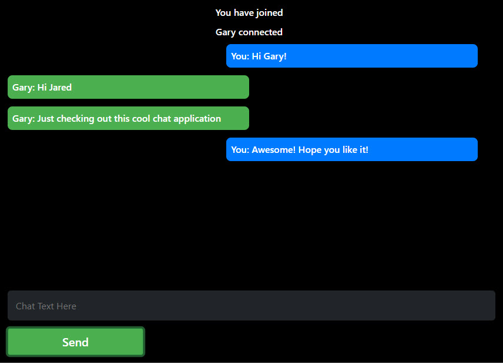

# Real-Time Chat Application with Socket.io

## https://my-socketio-chat-app.herokuapp.com/

## Table of Contents

- **[Description](#Description)**
- **[Installation Requirements](#Installation-Requirements)**
- **[Usage](#Usage)**
- **[License](#License)**
- **[Contributors](#Contributors)**
- **[Tests](#Tests)**
- **[Questions](#Questions)**

# Description

This employee directory is built using React.js and is a front end only application. The employee data is imported from a .json file and javascript .map and .sort methods are used to render the data upon search of terms. The app uses class components and changes the state of the list upon search.

## User Story

- As a user, I want to be able to view my entire employee directory at once so that I have quick access to their information.

# Installation Requirements

1. Clone repo by entering in the CLI: git clone https://github.com/jaredseefried/employee-directory-with-react.git 

2. Install required libraries from entering in the command line: npm i

# License

MIT

# Have Questions?

## [Github Profile: github.com/jaredseefried](https://github.com/jaredseefried "Title")

Please email me at jared.seefried@yahoo.com if you have additional questions.
